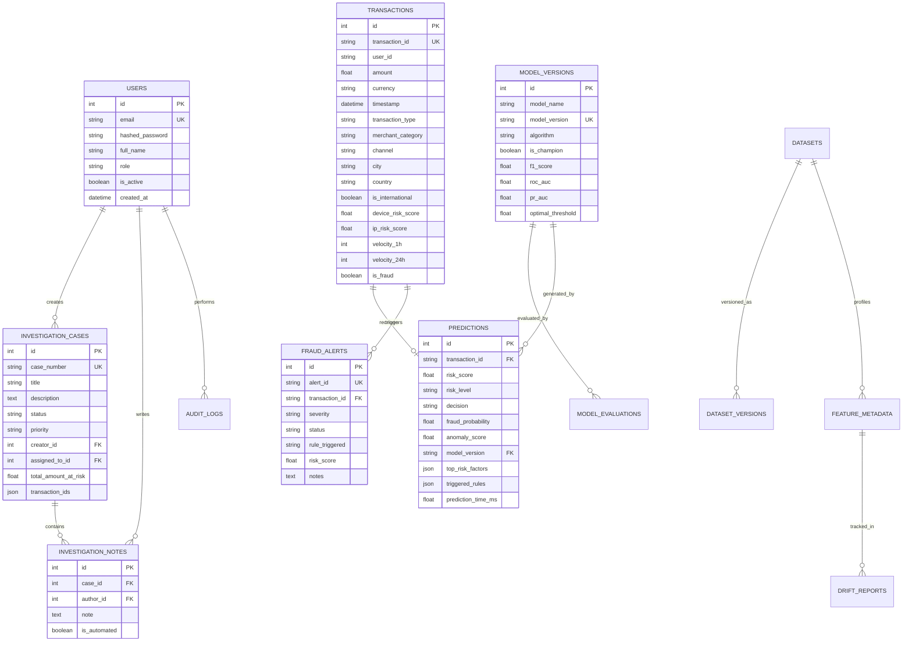

# FraudGuard AI — Database Architecture & Schema Specification

## 1. Overview
The persistence layer of FraudGuard AI is engineered using SQLAlchemy 2.0 declarative models. It runs by default on an embedded SQLite database in WAL (Write-Ahead Logging) mode, providing high concurrency without table lock contention, and is fully compatible with enterprise PostgreSQL.

---

## 2. Entity-Relationship Diagram (ERD)

---

## 3. Relational Table Catalog

### 3.1 `users`
Stores system operators, fraud analysts, and administrators.
- `id` (Integer, Primary Key)
- `email` (String(255), Unique, Indexed)
- `hashed_password` (String(255), Bcrypt)
- `full_name` (String(100))
- `role` (Enum: `ADMIN`, `ANALYST`, `USER`)
- `is_active` (Boolean, Default: True)
- `created_at` (DateTime)
- `last_login` (DateTime, Nullable)

### 3.2 `transactions`
Forensic ledger of monitored payment events.
- `id` (Integer, Primary Key)
- `transaction_id` (String(64), Unique, Indexed)
- `user_id` (String(64), Indexed)
- `amount` (Float, Indexed)
- `currency` (String(3))
- `timestamp` (DateTime, Indexed)
- `transaction_type` (String(32), Indexed)
- `merchant_category` (String(32), Indexed)
- `channel` (String(32))
- `city`, `country`, `is_international`
- `ip_address`, `device_type`
- `device_risk_score`, `ip_risk_score` (Float)
- `velocity_1h`, `velocity_24h` (Integer)
- `avg_amount_ratio`, `distance_from_home` (Float)
- `is_first_time_merchant`, `is_failed_attempt_prior` (Boolean)
- `is_fraud` (Boolean, Nullable)

### 3.3 `predictions`
Audit trail of real-time machine learning inference outputs.
- `id` (Integer, Primary Key)
- `transaction_id` (String(64), ForeignKey('transactions.transaction_id'), Unique, Indexed)
- `risk_score` (Float, Indexed)
- `risk_level` (Enum: `LOW`, `MEDIUM`, `HIGH`, `CRITICAL`)
- `decision` (Enum: `APPROVE`, `REVIEW`, `BLOCK`, Indexed)
- `fraud_probability`, `anomaly_score`, `confidence_score` (Float)
- `model_version` (String(64), Indexed)
- `prediction_time_ms` (Float)
- `top_risk_factors` (JSON - Serialized SHAP values)
- `triggered_rules` (JSON - List of violated safeguard rules)
- `created_at` (DateTime)

### 3.4 `fraud_alerts`
Active security triage queue for flagged transactions.
- `id` (Integer, Primary Key)
- `alert_id` (String(64), Unique, Indexed)
- `transaction_id` (String(64), ForeignKey('transactions.transaction_id'), Indexed)
- `severity` (Enum: `LOW`, `MEDIUM`, `HIGH`, `CRITICAL`, Indexed)
- `status` (Enum: `PENDING`, `UNDER_REVIEW`, `RESOLVED`, `ESCALATED`, `FALSE_POSITIVE`, Indexed)
- `rule_triggered` (String(128))
- `risk_score` (Float)
- `assigned_to` (String(100), Nullable)
- `notes` (Text, Nullable)
- `created_at`, `resolved_at` (DateTime)

### 3.5 `investigation_cases`
Formal incident dossiers and chargeback management.
- `id` (Integer, Primary Key)
- `case_number` (String(32), Unique, Indexed)
- `title` (String(255))
- `description` (Text, Nullable)
- `status` (Enum: `OPEN`, `IN_PROGRESS`, `RESOLVED`, `CLOSED`, Indexed)
- `priority` (Enum: `LOW`, `MEDIUM`, `HIGH`, `CRITICAL`, Indexed)
- `creator_id` (Integer, ForeignKey('users.id'))
- `assigned_to_id` (Integer, ForeignKey('users.id'), Nullable)
- `transaction_count` (Integer)
- `total_amount_at_risk` (Float)
- `transaction_ids` (JSON)
- `created_at`, `updated_at`, `resolved_at` (DateTime)

### 3.6 `investigation_notes`
Chronological activity log and analyst findings for case files.
- `id` (Integer, Primary Key)
- `case_id` (Integer, ForeignKey('investigation_cases.id'), Indexed)
- `author_id` (Integer, ForeignKey('users.id'))
- `note` (Text)
- `is_automated` (Boolean, Default: False)
- `created_at` (DateTime)

### 3.7 `model_versions` & `model_evaluations`
Model governance registry tracking performance metrics, confusion matrices, and champion deployment history.

### 3.8 `datasets`, `dataset_versions`, `feature_metadata`
Catalog of ingested data partitions, null percentages, correlations, and schema distributions.

### 3.9 `drift_reports`
Recorded Population Stability Index (PSI) drift tracking metrics per feature.

### 3.10 `audit_logs`
Regulatory action logs recording actor email, action taken, resource target, and source IP.

### 3.11 `system_settings`
Global runtime parameters (e.g. risk thresholds, auto-blocking flags).
