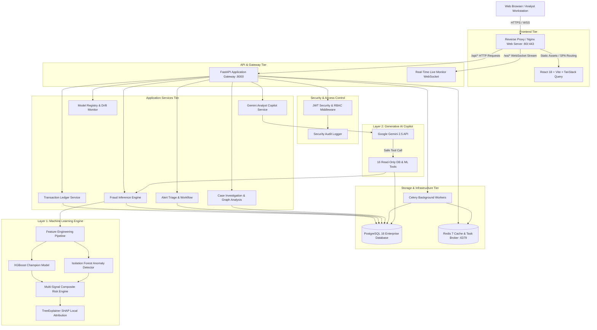
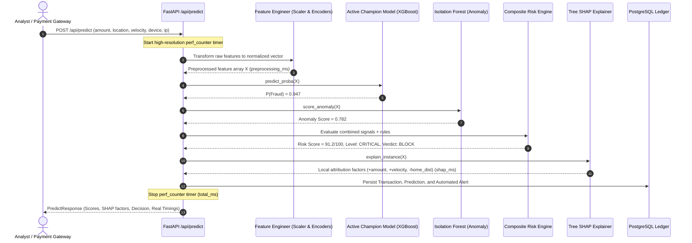
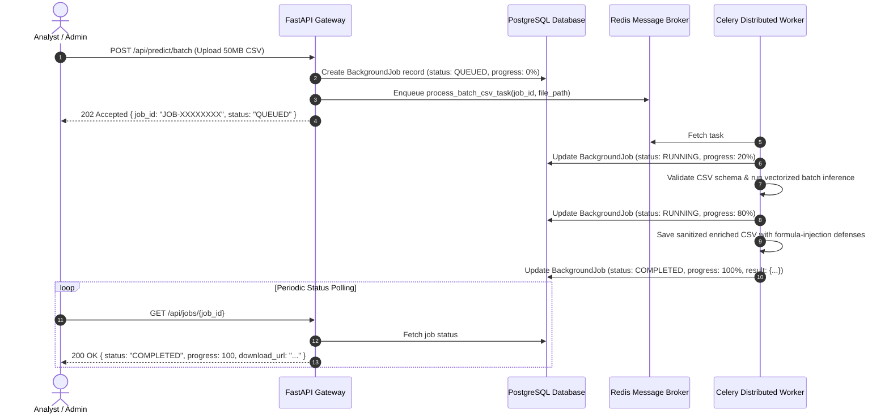

# FraudGuard AI — Final Production Architecture

## 1. System Architecture Overview



---

## 2. Real-Time Transaction Inference Pipeline

Every transaction undergoes an authentic, synchronous machine learning pipeline without synthetic latency:



---

## 3. Asynchronous Heavy Job Execution (Celery + Redis)

For large batch CSV processing and model retraining, tasks are handled asynchronously so HTTP connections never timeout:



---

## 4. Multi-Container Production Topology

```
                  INTERNET
                     │
                     ▼
        Reverse Proxy: Nginx (Port 80/443)
          │                      │
          │ /api/*               │ Static HTML/JS
          ▼                      ▼
  FastAPI Backend         React 18 + Vite SPA
  Container               Container
    │         │
    │         │ Enqueue Tasks
    ▼         ▼
PostgreSQL   Redis 7
Database     Message Broker
    │         │
    │         ▼
    └──── Celery Background
          Worker Container
```
