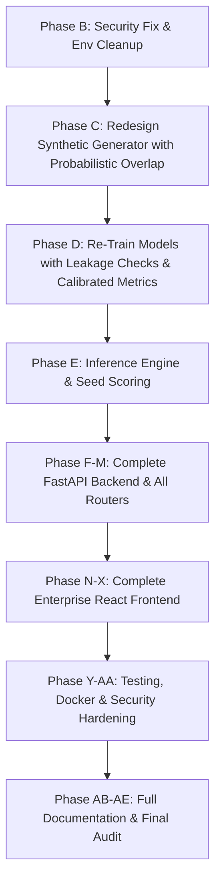

# FraudGuard AI — System Audit & Comprehensive Gap Analysis

**Date:** 2026-09-24  
**Auditor:** FraudGuard Architecture & Engineering Team  
**Scope:** Full-Stack Web Application, Machine Learning Pipeline, Database, Security, UI/UX, and Operations

---

## 1. Executive Summary

A comprehensive forensic audit of the `FraudGuard AI` repository was performed across all architectural layers. While the repository established a solid initial directory scaffold and baseline ML model wrappers, critical architectural, security, and machine learning defects were identified. Most notably:
1. **The Machine Learning models produced suspiciously perfect metrics (F1 = 1.0000, ROC-AUC = 1.0000)** due to deterministic synthetic data generation where `ip_risk` and `device_risk` acted as complete target proxies.
2. **Public registration allowed unauthenticated clients to register as `ADMIN` or `ANALYST`**, violating privilege separation principles.
3. **The FastAPI application entrypoint, API routes (Transactions, Predictions, Dashboard, Alerts, Investigations, Datasets, Models, Monitoring, Copilot, WebSocket), and background job worker were missing.**
4. **The entire React frontend was missing.**
5. **Database predictions, alerts, and investigations were not populated.**
6. **A sensitive `.env` file was present in the root folder instead of strictly adhering to `.env.example`.**

This document establishes the verified hardware baseline, details every gap, and defines the prioritized remediation plan executed in Phases B through AE.

---

## 2. Verified Hardware & Runtime Baseline

Direct inspection of the Windows development environment via WMI (`Win32_Processor`, `Win32_OperatingSystem`, `Win32_PhysicalMemory`, `Win32_VideoController`) revealed:

| Parameter | Detected Value | Operational Implications |
| :--- | :--- | :--- |
| **OS** | Windows 11 Home 64-bit (Build 10.0.26200) | Native Windows PowerShell & Python runtimes |
| **CPU** | 11th Gen Intel(R) Core(TM) i3-1115G4 @ 3.00GHz | 2 physical cores, 4 logical processors (Max clock 2.99 GHz) |
| **Concurrency** | 4 logical threads | Multi-threading / parallel jobs set to `n_jobs=4` |
| **RAM** | 8,162,616 KB (~8.0 GB RAM total) | 2x 4GB DDR4 (one 3200MHz, one 2667MHz); ~1.05 GB free physical RAM |
| **GPU** | Intel(R) UHD Graphics (Integrated, 1 GB shared) | CPU-optimized Scikit-learn, XGBoost, LightGBM, and TreeExplainer |
| **Disk Storage** | Drive `I:\` has 108.2 GB free; Drive `C:\` has 32.2 GB free | Abundant space for datasets, model artifacts, and frontend bundles |
| **Python** | 3.12.10 | FastAPI, SQLAlchemy 2.0, Scikit-learn 1.6, XGBoost 3.4, LightGBM 4.7, SHAP 0.52 |
| **Node / NPM** | Node.js v24.14.0 \| npm 11.9.0 | Modern Vite, React 18, TypeScript, Tailwind CSS, Lucide, Recharts |

---

## 3. Forensic Gap Breakdown by Architectural Layer

### A. Machine Learning Pipeline & Data Generation
* **Current State:**
  * Models (`LogisticRegression`, `RandomForest`, `XGBoost`, `LightGBM`) were trained on synthetic data and achieved 1.0000 on Precision, Recall, F1, and ROC-AUC.
  * SHAP TreeExplainer attributed over 9.24 to `ip_risk` and 0.0 to nearly all other features.
* **Root Cause:**
  * In `ml/preprocessing/generator.py`, legitimate transactions generated `ip_risk` strictly in `[0.01, 0.25]`, while fraudulent transactions generated `ip_risk` strictly in `[0.55, 0.98]`.
  * The synthetic data contained a deterministic hyperplane separation on a single column, making classification trivial and non-representative of real-world financial fraud.
* **Required State:**
  * Probabilistic, overlapping distributions where legitimate customers occasionally experience new devices, IP shifts, travel, or high transaction amounts, and fraudulent transactions occasionally mimic normal patterns.
  * Multi-feature interplay with subtle interactions (velocity + balance depletion + night hours + geographic jumps).
  * Realistically distributed metrics (e.g., F1 between 0.82 and 0.94, Precision/Recall trade-offs, genuine threshold optimization).

### B. Security & Authentication
* **Current State:**
  * In `backend/app/schemas/auth.py`, `UserRegisterRequest` allowed an optional `role: UserRole = UserRole.ANALYST`, enabling any unauthenticated user to submit `{"role": "ADMIN"}` and escalate privileges immediately.
  * A plaintext `.env` file was created in the root directory.
* **Required State:**
  * Public registration schema strictly omits the `role` field; public registrations always create `UserRole.USER`.
  * Privileged roles (`ADMIN`, `ANALYST`) can only be assigned by existing Admins via authenticated admin endpoints or through local seed scripts.
  * The root `.env` must be removed from git tracking; `.env.example` serves as the official template.

### C. Backend API & Server Entrypoint
* **Current State:**
  * `backend/app/main.py` is missing.
  * Routers for Transactions, Predictions, Dashboard Analytics, Alerts, Investigations, Datasets, Models, Monitoring, Audit, and WebSocket are missing.
* **Required State:**
  * Unified `backend/app/main.py` FastAPI app with CORS middleware, structured logging, global exception handling, OpenAPI docs (`/docs` and `/redoc`), and `/health` + `/ready` endpoints.
  * Fully implemented routers adhering to REST standards, Pydantic v2 schemas, and SQLAlchemy 2.0 ORM operations.

### D. Database & Seeding
* **Current State:**
  * 3,000 raw transactions exist in `fraudguard.db`, but `predictions`, `fraud_alerts`, and `investigation_cases` are empty (0 records).
* **Required State:**
  * Background execution of the actual inference pipeline over seeded transactions to create genuine predictions, fraud alerts, and active investigation cases.

### E. Frontend Application
* **Current State:**
  * `frontend/` contains only empty directories; no `package.json`, Vite configuration, React components, or router exist.
* **Required State:**
  * Complete, professional React 18 + Vite + TypeScript + Tailwind CSS application.
  * Strict avoidance of AI visual clichés (no neon purples, glowing borders, animated floating particles, or brain/sparkle badges).
  * High-density, professional fintech console styling (neutral slate/zinc surfaces, accessible status badges, responsive tables, server-side pagination, interactive Recharts visualizations).
  * All 19 required routes implemented and functional:
    * `/` (Landing Page)
    * `/login` & `/register`
    * `/dashboard`
    * `/analyze` (Single Transaction Live Analysis)
    * `/transactions` (Explorer & CSV Export)
    * `/transactions/:id` (Transaction Forensic Details)
    * `/alerts` (Alert Management Operations)
    * `/investigations` (Case Management Console)
    * `/investigations/:id` (Investigation Workspace)
    * `/batch-analysis` (CSV File Upload & Batch Scoring)
    * `/live-monitor` (Real-Time Transaction Stream)
    * `/models` & `/admin/models` (Model Training Center & Comparison)
    * `/datasets` & `/admin/datasets` (Dataset Quality Profiler)
    * `/monitoring` & `/admin/monitoring` (Data Drift PSI & System Telemetry)
    * `/copilot` (Grounded Analyst Assistant)
    * `/admin` & `/admin/users` & `/admin/audit-logs` (Admin Operations)

### F. DevOps, Testing & Documentation
* **Current State:**
  * Dockerfiles, `docker-compose.yml`, and GitHub Actions workflow are missing.
  * End-to-end browser tests are missing.
  * Documentation is empty in `docs/`.
* **Required State:**
  * Complete test suites across unit, integration, ML leakage, API, and frontend.
  * Multi-stage Dockerfiles and `docker-compose.yml` supporting PostgreSQL and Redis.
  * Comprehensive documentation (`architecture.md`, `ml-pipeline.md`, `database.md`, `security.md`, `testing.md`, `deployment.md`, `user-guide.md`, `viva-notes.md`, `project-report.md`).

---

## 4. Prioritized Remediation Roadmap

Execution proceeds immediately with Phase B.
